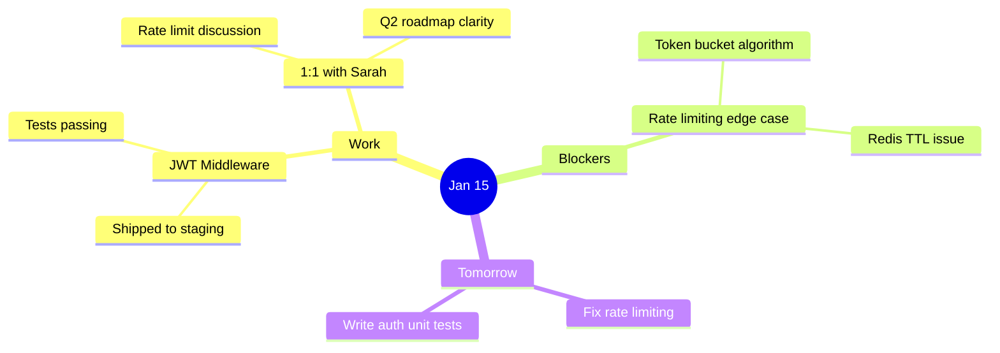

# ⬡ NoteForge — Obsidian Daily Note Forge

> **An HTML dashboard + Python/Ollama backend that expands your raw daily notes into rich, detailed Obsidian Markdown files — with Mermaid mind maps, timelines, Dataview frontmatter, callout blocks, wikilinks, and more.**

> [!WARNING]
> USE NOTOFORGE V2 OR LATEST RELEASE!!
---

## Table of Contents

1. [What It Does](#what-it-does)
2. [Architecture](#architecture)
3. [Requirements](#requirements)
4. [Quick Start](#quick-start)
5. [HTML Dashboard Features](#html-dashboard-features)
6. [Python Backend API](#python-backend-api)
7. [CLI Mode](#cli-mode)
8. [Prompt Presets](#prompt-presets)
9. [Obsidian Feature Injections](#obsidian-feature-injections)
10. [Customizing the AI Prompt](#customizing-the-ai-prompt)
11. [Configuration Reference](#configuration-reference)
12. [Example Generated Note](#example-generated-note)
13. [Obsidian Setup Tips](#obsidian-setup-tips)
14. [Troubleshooting](#troubleshooting)
15. [FAQ](#faq)

---

## What It Does

You type rough daily notes into a sleek dashboard — what happened, your mood, energy, wins, blockers, and tomorrow's intentions. You click **Generate & Send**. The backend:

1. Builds a rich, structured prompt from your input
2. Sends it to a **local Ollama LLM** (fully private, no cloud)
3. Gets back an expanded, beautiful Obsidian-flavored Markdown note
4. Writes it directly into your **Obsidian vault** folder
5. Optionally opens it in Obsidian automatically

The generated note includes:
- Full YAML frontmatter (Dataview compatible)
- Mermaid **mind map** of the day's themes
- Mermaid **timeline** of key events
- `> [!insight]` / `> [!tip]` / `> [!warning]` callout blocks
- `[[wikilinks]]` for people, projects, and concepts
- Tasks plugin-compatible task lists for tomorrow
- Gratitude section, lessons learned, key quote of the day
- Reflective narrative expansion of your raw notes

---

## Architecture

```
Browser (index.html)
      │
      │  HTTP POST /generate
      ▼
Flask Backend (server.py)
      │
      │  POST /api/chat
      ▼
Ollama (local LLM)
      │
      │  Generated Markdown
      ▼
Flask Backend
      │
      │  Write file
      ▼
Obsidian Vault  ──►  obsidian:// URI  ──►  Obsidian App
```

**All data stays local.** No API keys. No cloud. No telemetry.

---

## Requirements

| Dependency       | Version  | Notes                                      |
|------------------|----------|--------------------------------------------|
| Python           | 3.9+     |                                            |
| pip packages     | see below|                                            |
| Ollama           | latest   | https://ollama.com — must be running       |
| An Ollama model  | any      | `llama3`, `mistral`, `gemma2`, etc.        |
| Obsidian         | optional | Needed to actually open/view the notes     |

### Python packages

```bash
pip install flask flask-cors requests
```

### Ollama

Install Ollama from [https://ollama.com](https://ollama.com), then pull a model:

```bash
# Good balance of quality and speed
ollama pull llama3

# Larger, higher quality
ollama pull llama3:70b

# Fast and lightweight
ollama pull mistral

# Good for structured output
ollama pull gemma2
```

Start Ollama (if not already running as a service):

```bash
ollama serve
```

---

## Quick Start

### 1. Clone / download the files

Place `index.html`, `server.py`, and `README.md` in the same folder.

### 2. Start the backend

```bash
python server.py
```

You should see:

```
  _   _       _       _____
 | \ | |     | |     |  ___|___  _ __ __ _  ___
 ...
NoteForge server on http://127.0.0.1:5000
Ollama: http://localhost:11434 | Model: llama3
Vault:  ~/obsidian-vault / Daily Notes
```

### 3. Open the dashboard

Open `index.html` in your browser (double-click or `file:///path/to/index.html`).

### 4. Configure

Click **Configuration** in the sidebar and set:
- **Vault path**: full path to your Obsidian vault (e.g. `/home/you/Documents/MyVault`)
- **Model**: the Ollama model name (e.g. `llama3`, `mistral`)

Click **Save**.

### 5. Write a note

Fill in your daily entry fields and click **Generate & Send**.

---

## HTML Dashboard Features

### Compose Tab
- **Entry fields**: title, date, raw notes body, energy (1–10), focus area
- **Mood picker**: one-click emoji mood selector
- **Wins, blockers, intentions**: separate text areas fed into the prompt
- **Tag builder**: press Enter or comma to add tags — rendered as chips
- **Obsidian links**: specify notes to weave `[[wikilinks]]` into

### AI Prompt Customizer
- **Live-editable system prompt**: full control over what the AI writes
- **6 preset styles**: Deep Journal, Dev Log, Executive, Stoic, Creative, Minimal
- **Tone selector**: reflective, analytical, motivational, journalistic, stoic, casual
- **Length selector**: medium (~400w), long (~800w), epic (1500w+)
- **Extra instructions**: ad-hoc additions per note

### Preview Tab
- Live Markdown preview of the generated note
- Word count display
- **Copy** to clipboard
- **Download** as `.md`
- **Send to Obsidian** button (writes to vault)

### Note History
- Local browser history of all generated notes
- Filename, word count, date displayed
- Clear history button

### Configuration Tab
- All backend, Ollama, and vault settings in one place
- Persisted in `localStorage`

### Obsidian Features Tab
- Toggle 12 individual Obsidian features on/off
- Each enabled feature is automatically injected into the AI prompt

### Server Logs Tab
- Live timestamped log of all backend communications
- Color-coded: INFO / OK / WARN / ERR

### Stats Dashboard
- Total notes generated
- Notes sent to Obsidian
- Mind maps created
- Writing streak (consecutive days)

---

## Python Backend API

### `GET /health`

Returns server and Ollama status.

```json
{
  "status": "ok",
  "ollama": true,
  "ollama_status": "ok — 3 model(s) loaded",
  "model": "llama3",
  "server": "NoteForge v1.0"
}
```

### `POST /generate`

Generate a note. Returns the note content without saving.

**Request body:**
```json
{
  "title":         "Optional headline",
  "date":          "2025-01-15",
  "body":          "Raw daily notes...",
  "mood":          "✨ Energized",
  "energy":        "8",
  "focus":         "creative",
  "wins":          "Shipped the auth page",
  "blockers":      "Stuck on rate limiting",
  "tomorrow":      "Fix rate limit, write tests",
  "tags":          ["rust", "tauri", "projects"],
  "links":         "[[Project Alpha]], [[Goals 2025]]",
  "system_prompt": "Optional custom system prompt",
  "tone":          "reflective",
  "length":        "long",
  "extra":         "Always include a gratitude section",
  "features":      ["Mermaid Mind Map", "Dataview Frontmatter"],
  "config": {
    "ollama":  "http://localhost:11434",
    "model":   "llama3",
    "vault":   "~/obsidian-vault",
    "folder":  "Daily Notes",
    "temp":    0.75,
    "tokens":  4096
  }
}
```

**Response:**
```json
{
  "note":     "---\ntitle: ...\n...",
  "filename": "2025-01-15-shipped-auth-page.md",
  "words":    847,
  "date":     "2025-01-15"
}
```

### `POST /send`

Write a previously-generated note to the vault.

**Request body:**
```json
{
  "content":  "--- full markdown ---",
  "filename": "2025-01-15-daily.md",
  "config":   { "vault": "~/vault", "folder": "Daily Notes", "autoopen": "true" }
}
```

**Response:**
```json
{
  "status":   "ok",
  "path":     "/home/user/vault/Daily Notes/2025-01-15-daily.md",
  "filename": "2025-01-15-daily.md",
  "vault":    "/home/user/vault",
  "streak":   7
}
```

### `GET /models`

List available Ollama models.

### `GET /history`

List `.md` files in the vault's daily notes folder (last 50, newest first).

### `GET /note/<filename>`

Return the raw content of a specific note.

### `DELETE /note/<filename>`

Delete a note.

### `GET /vault/stats`

Return vault statistics: total notes, total words, streak, today's count.

---

## CLI Mode

Run NoteForge entirely from the terminal — no browser needed:

```bash
python server.py --cli
```

You'll be prompted interactively for all fields. The generated note is printed and optionally saved to your vault.

```bash
# Custom model and vault in CLI mode
python server.py --cli --model mistral --vault ~/Documents/MyVault

# Different Ollama host (e.g. running on another machine)
python server.py --cli --ollama http://192.168.1.10:11434
```

**CLI example session:**
```
  _   _       _       _____
 ...

──────────────────────────────────────────────
  New Daily Note
──────────────────────────────────────────────
  Date [2025-01-15]: 
  Title / headline: Shipped auth, great 1:1
  Mood [Neutral]: Energized
  Energy (1–10) [7]: 9
  Focus area [general]: work

  What happened today? (blank line to finish):
    > Finished the JWT middleware
    > 1:1 with Sarah went really well
    > 

  Wins / accomplishments (blank line to finish):
    > JWT auth shipped to staging
    > 

  Blockers / challenges (blank line to finish):
    > Rate limiting edge case still open
    > 

  Tomorrow's intentions (blank line to finish):
    > Fix rate limiting, write auth unit tests
    > 

  Tags (comma-separated): rust, auth, tauri
  Obsidian links to weave in: [[Project Tauri App]], [[Sarah]]
  Prompt preset [journal/dev/...] [journal]: dev

  Generating note via Ollama…
──────────────────────────────────────────────

  ✓ Generated 923 words

  ---
  title: "Shipped auth, great 1:1"
  date: 2025-01-15
  ...

  Save to vault? [y]: y
  ✓ Saved: /home/user/vault/Daily Notes/2025-01-15-shipped-auth-great-11.md
  Open in Obsidian? [y]: y
```

---

## Prompt Presets

| Preset      | Best for                          | Style                                    |
|-------------|-----------------------------------|------------------------------------------|
| Deep Journal| Personal reflection, emotions     | First-person, literary, 800+ words       |
| Dev Log     | Software engineering days         | Structured, technical, Mermaid diagrams  |
| Executive   | Business / leadership days        | Sharp, high-signal, tables, action items |
| Stoic       | Philosophy, discipline, resilience| Marcus Aurelius vibes, dichotomy of control|
| Creative    | Art, writing, design days         | Evocative, metaphorical, inspiration-led |
| Minimal     | Quick capture, low overhead       | Bullets, 3 sentences, under 300 words    |

---

## Obsidian Feature Injections

| Feature             | What it adds to the note                            |
|---------------------|-----------------------------------------------------|
| Mermaid Mind Map    | `mindmap` diagram of day's themes and ideas         |
| Mermaid Timeline    | `timeline` diagram of key events                    |
| Dataview Frontmatter| Full YAML with date, tags, mood, energy, focus, etc.|
| Callout Blocks      | `[!insight]`, `[!tip]`, `[!warning]`, `[!quote]`   |
| Tasks Plugin        | `- [ ]` task items with due dates and priorities    |
| Wiki Links          | `[[like this]]` for people, projects, concepts      |
| Graph Tags          | Tags chosen for good Obsidian graph clustering      |
| Kanban Card         | Embedded Kanban board snippet                       |
| Periodic Notes      | Weekly/monthly review prompts on Fri/month-end      |
| Spaced Repetition   | Flagged key learnings for Anki review               |
| Breadcrumbs         | `parent`/`child` metadata for note hierarchy        |
| Templater Vars      | `<% tp.date.now() %>` style Templater placeholders  |

---

## Customizing the AI Prompt

The system prompt text area in the dashboard is fully editable. Some ideas:

```
Always include a "Gratitude" section with 3 things I'm grateful for.
Reference my annual goal of shipping a SaaS product by Q3.
If it's Friday, add a "Weekly Review" section.
Use stoic philosophy language.
Include a 5-minute evening meditation prompt at the end.
Always end with a haiku about the day.
```

You can also change the system prompt per-note, then reset to your default anytime.

---

## Configuration Reference

| Setting        | Default                    | Description                             |
|----------------|----------------------------|-----------------------------------------|
| Backend URL    | `http://localhost:5000`    | Where `server.py` is running            |
| Ollama Host    | `http://localhost:11434`   | Ollama API URL                          |
| Ollama Model   | `llama3`                   | Model name (must be pulled with ollama) |
| Vault Path     | `~/obsidian-vault`         | Absolute path to your Obsidian vault    |
| Daily Notes Folder | `Daily Notes`          | Subfolder inside the vault              |
| Date Format    | `YYYY-MM-DD`               | Filename date prefix format             |
| Temperature    | `0.75`                     | LLM creativity (0 = deterministic)      |
| Max Tokens     | `4096`                     | Max output length in tokens             |
| Auto-open      | `true`                     | Open in Obsidian after saving           |

**CLI flags:**

```bash
python server.py --help

  --port    SERVER_PORT   (default: 5000)
  --host    BIND_ADDRESS  (default: 127.0.0.1)
  --ollama  OLLAMA_URL    (default: http://localhost:11434)
  --model   MODEL_NAME    (default: llama3)
  --vault   VAULT_PATH    (default: ~/obsidian-vault)
  --folder  FOLDER_NAME   (default: Daily Notes)
  --debug                 Flask debug mode
  --cli                   Interactive CLI instead of web server
```

---

## Example Generated Note

```markdown
---
title: "JWT Shipped, Great 1:1 with Sarah"
date: 2025-01-15
aliases: ["2025-01-15", "Jan 15 2025"]
tags: [daily-note, rust, auth, tauri, work]
mood: "✨ Energized"
energy: 9
focus: work
created: 2025-01-15T21:30:00
day_of_week: Wednesday
week: "2025-W03"
---

# 🗓 Wednesday, January 15 — *The Day Auth Shipped*

> [!quote] Key Insight
> Momentum compounds. One shipped feature is worth ten planned ones.

## Executive Summary
Today was a high-energy, high-output day. The JWT middleware — something I'd been chipping away at for a week — finally landed on staging. The auth flow is clean, the tests pass, and Sarah's 1:1 gave me real clarity on the rate-limiting blocker...

## 🧠 Mind Map



## 📅 Day Timeline

```mermaid
timeline
    title January 15 — Key Events
    09:00 : Morning standup
    10:30 : JWT middleware final fixes
    12:00 : Lunch + code review
    14:00 : 1:1 with [[Sarah]]
    16:00 : Shipped auth to staging
    18:00 : Planning tomorrow's sprint
```

## 🏆 Wins

> [!tip] Win #1 — JWT Auth Shipped 🎉
> After 5 days of iteration, the [[JWT Middleware]] is live on staging. The token refresh flow is clean...

## 🧱 Blockers

> [!warning] Rate Limiting Edge Case
> The token bucket algorithm has a race condition under high concurrency...

## 🔮 Tomorrow's Focus

- [ ] 🔴 Fix rate limiting race condition in [[Auth Module]] 📅 2025-01-16
- [ ] 🟡 Write unit tests for JWT refresh flow
- [ ] 🟢 Code review for [[Sarah]]'s PR

## 🙏 Gratitude
1. The codebase is actually maintainable now.
2. Sarah's feedback was direct and useful.
3. I had the energy to push through today.

## 💬 Quote of the Day
*"You have power over your mind — not outside events. Realize this, and you will find strength."* — Marcus Aurelius

---
*Generated by NoteForge · [[Daily Notes MOC]] · [[2025-W03]]*
```

---

## Obsidian Setup Tips

### Recommended plugins

- **Dataview** — query your notes like a database using the YAML frontmatter
- **Tasks** — track `- [ ]` task items across notes
- **Calendar** — see your daily notes on a calendar view
- **Periodic Notes** — enhanced daily/weekly/monthly note management
- **Breadcrumbs** — navigate note hierarchies
- **Excalidraw or Mermaid** — render the Mermaid diagrams

### Example Dataview queries

List this week's notes by energy:
```dataview
TABLE mood, energy, focus
FROM "Daily Notes"
WHERE date >= date(today) - dur(7 days)
SORT energy DESC
```

Find all days where energy was below 5:
```dataview
LIST
FROM "Daily Notes"
WHERE energy < 5
SORT date ASC
```

Show all blockers this month:
```dataview
LIST blockers
FROM "Daily Notes"
WHERE date >= date(sow)
```

### Folder structure suggestion

```
ObsidianVault/
├── Daily Notes/
│   ├── 2025-01-15-jwt-shipped.md
│   ├── 2025-01-16-daily.md
│   └── ...
├── Projects/
├── People/
└── Resources/
```

---

## Troubleshooting

### "Cannot connect to Ollama"
```bash
# Check Ollama is running
ollama serve

# Or check if it's already running
ps aux | grep ollama

# Test directly
curl http://localhost:11434/api/tags
```

### "Model not found"
```bash
# List available models
ollama list

# Pull the model you want
ollama pull llama3
ollama pull mistral
```

### "Permission denied writing note"
- Make sure the vault folder exists and is writable
- On Linux/Mac: `chmod 755 ~/obsidian-vault`
- Check the path in Configuration — use the full absolute path

### CORS errors in the browser
The server runs with `flask-cors` enabled for all origins. If you still see CORS errors:
```bash
# Run with debug to see what's happening
python server.py --debug
```

### Note isn't opening in Obsidian
- Make sure Obsidian is installed and the vault is open
- On Linux, `xdg-open` must be able to handle `obsidian://` URIs
- Try manually opening Obsidian first, then generating a note

### Generated note is too short
- Switch to "Epic" length mode
- Use the "Deep Journal" preset
- Add to Extra Instructions: "Write at least 1000 words. Be detailed and thorough."
- Try a larger model: `ollama pull llama3:70b`

---

## FAQ

**Q: Is my data sent to any cloud service?**
No. Everything runs locally. The HTML talks to `localhost:5000`, which talks to Ollama on `localhost:11434`. Zero external network calls.

**Q: Which model should I use?**
- `llama3` (8B) — good default, fast, quality output
- `mistral` (7B) — fast, slightly more concise
- `llama3:70b` — best quality but slower, needs 48GB+ RAM or GPU
- `gemma2` — excellent structured output

**Q: Can I run the server and open the HTML from the same machine?**
Yes. Open `index.html` from the filesystem (`file:///`) — it communicates with the Flask backend via `localhost`.

**Q: Can I use this with a remote Ollama server?**
Yes. Change the Ollama Host in Configuration to the remote machine's IP/URL, e.g. `http://192.168.1.50:11434`.

**Q: Does it work without Obsidian installed?**
Yes — you can use the Download .md button in the Preview tab to save notes manually.

**Q: Can I add my own Obsidian features to the toggle list?**
Yes — edit the `obsidianFeatures` array in `index.html` (around line 450 in the JS section).

---

## License

MIT — free to use, modify, and distribute. Built for personal productivity.

---

*NoteForge — Because your days deserve better than a bullet point.*
